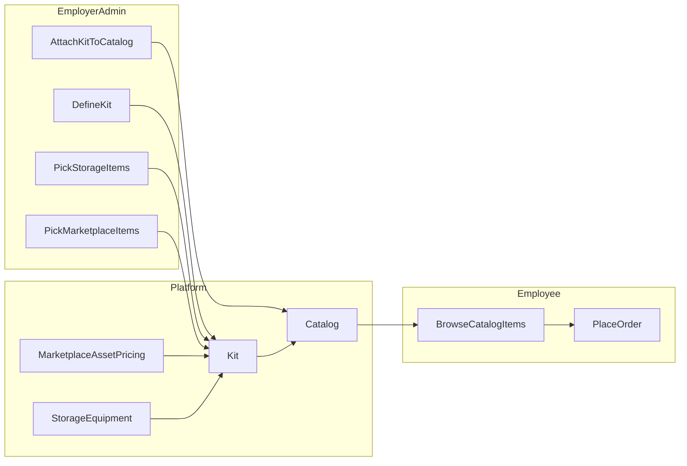

# PRD: Kits, curated budget catalogs, and in-storage assets

**Document status:** Draft  
**Last updated:** 2026-03-31  
**Owners:** Product / Engineering  

This document has **two parts**: **[Product PRD](#product-prd-for-all-audiences)** (readable by everyone on the team) and **[Technical specification](#technical-specification)** (implementation detail grounded in the codebase).

---

## Product PRD (for all audiences)

### 1. Executive summary

Large employers often operate in **several countries** and want **clear rules** for what gear new or existing employees may order. Today, the most flexible way to support **multiple countries** in our product leans on **budget-style catalogs**, which can feel like a **very large** shopping experience for employees who are not IT experts.

This initiative introduces **kits**—employer-defined **standard bundles** of approved devices and accessories—and allows **company-owned equipment already in Rayda storage** to appear alongside **marketplace** options when the employer chooses. Together, this gives employers **control and consistency** while keeping **budget and approval** rules where they already exist.

---

### 2. Problem we are solving

| Problem | Why it matters |
|--------|----------------|
| **Too much choice** | Employees may see a wide range of devices when the employer actually has a small set of approved standards. |
| **Multi-country complexity** | Policies must apply across countries without breaking **local pricing**, **currency**, or **availability**. |
| **Unused owned inventory** | Companies already store devices with Rayda; they want those devices to be **assignable** through the same employee-facing flows as new purchases, where appropriate. |

---

### 3. Goals

**Goals**

- Let employers define **kits** (named bundles) and attach them to catalogs so employees primarily see **employer-approved options**.
- Support **multi-country** operations without forcing a one-size-fits-one-country workflow.
- Allow **in-storage company assets** to be offered in catalog flows with correct **availability** and **fulfillment**.
- Preserve a **smooth upgrade path** for existing customers (see Technical: backward compatibility).

---

### 4. Who this is for (personas)

| Persona | Need |
|--------|------|
| **Employer admin** | Define standards (kits), choose what is in each kit (marketplace and/or storage), attach kits to the right catalogs, and align **country / level / department** rules with company policy. |
| **Employee** | See a **clear, short list** of options they are allowed to pick from; complete an order without becoming a hardware expert. |
| **Operations (Rayda / logistics)** | When an order includes **storage-backed** items, fulfill from the correct **location** and record **which physical unit** was shipped or assigned. |

---

### 5. User stories

*Format: As a \<role\>, I want \<capability\>, so that \<outcome\>.*

**Employer admin**

1. As an **employer admin**, I want to **create a named kit** (e.g. “Field Sales Standard”), so that **my teams get a consistent bundle** instead of browsing everything.
2. As an **employer admin**, I want to **add marketplace devices** to a kit, so that **employees only see SKUs my company has approved**.
3. As an **employer admin**, I want to **include devices we already hold in Rayda storage** in a kit, so that **we reuse inventory before buying new**.
4. As an **employer admin**, I want to **attach one or more kits to a catalog** that applies across **multiple countries**, so that **one policy works everywhere we operate** (subject to local availability).
5. As an **employer admin**, I want **budget and approval rules** to keep working as today, so that **finance and IT policies are not bypassed**.

**Employee**

6. As an **employee**, I want to **see only kit-approved options** when my employer uses kits, so that **I do not have to guess** which laptop or accessories are allowed.
7. As an **employee**, I want **prices and eligibility** to make sense **in my country**, so that **I am not shown things I cannot actually receive**.

**Operations**

8. As **operations staff**, when an order includes **storage inventory**, I want a **clear fulfillment path** (which unit, from where), so that **the right asset is assigned** and **records stay accurate**.

---

### 6. Product requirements (what must be true)

**Kits**

- A **kit** is a company-owned, reusable definition: a list of allowed items with a clear name and description.
- Kit items may come from **marketplace** (buy new / standard procurement flow) or from **company inventory in Rayda storage** (reuse / assign existing units), per product rules.
- Employers can attach **one or more kits** to a catalog so that **employee browsing is constrained** to those kits instead of an unconstrained list (exact behavior when kits are present is defined in Technical: catalog resolution).

**Multi-country**

- Catalogs must continue to support **which countries** the policy applies to, together with **levels** and **departments** as today.
- Employees should see options that are **valid for their country** and **consistent with employer currency / pricing rules**.

**In-storage inventory**

- Only **eligible** storage units may appear (e.g. available, not already committed—exact rules TBD).
- Selection, assignment, and audit expectations must be **explicit** so employers trust **ownership** and **traceability**.

---

### 7. Success metrics

- Fewer support cases about **“employees seeing too many devices”** for employers using kits on budget-style catalogs.
- **Adoption:** share of relevant catalogs that use at least one kit.
- **Operational quality:** success rate and time-to-fulfill for orders that include **storage-backed** lines.
- **Employer satisfaction (qualitative):** confidence in **multi-country** policy and **standard bundles**.

---

### 8. Phasing (product view)

| Phase | What ships (plain language) |
|-------|-----------------------------|
| **1** | Kits with **marketplace-only** items on the right catalog types; multi-country filtering and employer admin UX. |
| **2** | **In-storage** items in kits, with availability and internal fulfillment behavior. |
| **3** | Migration / admin tooling, analytics, polish. |

---

### 9. Open decisions (product / cross-functional)

These need answers from **Product**, **Finance**, and **Operations**—engineering will implement whichever policy is chosen.

1. **Budget impact:** Do **company-owned storage** items consume **catalog budget**, **partial budget**, or **none**?
2. **Price display:** For storage items, do we show **$0**, **book value**, **replacement value**, or **hide price**?
3. **Duplicates:** If the **same spec** exists as marketplace and storage, do we show **both**, **prefer storage**, or **merge**?
4. **Partial orders:** If part of a kit is unavailable, do we **block** checkout or allow **partial** fulfillment?
5. **Catalog types:** Should kits attach only to **budget** catalogs, or also to **device** catalogs for a single admin pattern?
6. **Rollout:** How do we move existing customers from **today’s budget behavior** to **kit-constrained** browsing without surprises?

---

### 10. Glossary (plain language)

| Term | Meaning |
|------|---------|
| **Catalog** | A policy container: who it applies to (countries, levels, departments) and how ordering works (device vs budget rules). |
| **Device catalog** | Employer picks **specific SKUs** allowed for that catalog. |
| **Budget catalog** | Employer sets **spend / budget** style rules; historically this also implied a **broad** device pool—kits change that story when attached. |
| **Kit** | A **named bundle** of allowed items (marketplace and/or storage). |
| **Marketplace item** | A purchasable SKU from Rayda’s catalog / pricing layer. |
| **In-storage item** | A **physical unit** (or pool of units) the company already stores with Rayda and wants to offer for assignment. |

---

## Technical specification

*The following sections describe **current implementation** in the codebase, **gaps**, and **technical direction**. They assume familiarity with Laravel (backend) and the existing catalog models.*

### T1. Current architecture (as implemented)

#### T1.1 Catalog types

The backend distinguishes catalog types via `CatalogTypeEnum`:

- **`device`:** Curated SKUs via the `catalog_assets` pivot (`asset_pricing_id` rows chosen by the employer).
- **`budget`:** Uses `catalog_configs` for limits; browsing resolves against marketplace pricing in a **broad** way (see T1.2).

**Reference:** [`remote-v2-backend/app/Domains/Enum/Catalog/CatalogTypeEnum.php`](../remote-v2-backend/app/Domains/Enum/Catalog/CatalogTypeEnum.php)

#### T1.2 How `Catalog::assets()` resolves

On [`Catalog`](../remote-v2-backend/app/Models/Catalog.php), `assets()` behaves by type:

- **Budget:** `AssetPricing::where(country_id = employee country, currency = employer currency)` — effectively a **wide pool**, not per-catalog curated rows.
- **Device:** `belongsToMany` through **`catalog_assets`** — explicit allowlist.

This is the core reason **budget + multi-country** is powerful for eligibility but **weak** for “standard devices only” unless we add kits or change resolution rules.

#### T1.3 API constraints today

`addCatalogAssets` / `removeAssetsFromCatalog` **reject** `type === budget` (“Wrong catalog type specified.”), so **curated rows cannot be attached** to budget catalogs via the existing pivot.

**Reference:** [`remote-v2-backend/app/Http/Controllers/V2/Backend/CatalogController.php`](../remote-v2-backend/app/Http/Controllers/V2/Backend/CatalogController.php)

#### T1.4 Multi-country catalogs

`CreateCatalogRequest` requires `country_ids`; `CatalogRepository::createCatalog` writes **`catalog_countries`**. The admin UI currently emphasizes **multi-select for budget** and a **single-country** flow for device catalog creation in places—backend can carry multiple countries; UX should align with desired product behavior.

**References:** [`remote-v2-backend/app/Http/Requests/CreateCatalogRequest.php`](../remote-v2-backend/app/Http/Requests/CreateCatalogRequest.php), [`remote-v2-backend/app/Repositories/CatalogRepository.php`](../remote-v2-backend/app/Repositories/CatalogRepository.php), [`remote-v2-frontend/src/container/Dashboard/Catalogs/CreateCatalogs/index.tsx`](../remote-v2-frontend/src/container/Dashboard/Catalogs/CreateCatalogs/index.tsx)

#### T1.5 Employee / admin asset listing with `catalog_id`

`AssetController::filterAssets` uses `$catalog->assets` when `catalog_id` is present—so **budget catalogs inherit the broad `AssetPricing` behavior** today.

**Reference:** [`remote-v2-backend/app/Http/Controllers/V2/Backend/AssetController.php`](../remote-v2-backend/app/Http/Controllers/V2/Backend/AssetController.php)

#### T1.6 Storage inventory model

- **`Equipment`:** Company-owned assets; status includes **`IN_STORAGE`** where applicable.
- **`EquipmentInStorage`:** Storage-specific row linked to equipment.
- **`Company`:** Helpers such as `items_in_storage()` for inventory-style queries.

**Gap:** No first-class link from a **catalog** to **specific storage equipment** as orderable lines in the same way as `catalog_assets` / `AssetPricing`.

**References:** [`remote-v2-backend/app/Models/Equipment.php`](../remote-v2-backend/app/Models/Equipment.php), [`remote-v2-backend/app/Models/EquipmentInStorage.php`](../remote-v2-backend/app/Models/EquipmentInStorage.php), [`remote-v2-backend/app/Models/Company.php`](../remote-v2-backend/app/Models/Company.php)

---

### T2. Technical requirements

#### T2.1 Functional (engineering)

1. **Kit entity** scoped to `company_id` with CRUD and audit fields.
2. **Kit items** with `source ∈ { marketplace, storage }` and stable foreign keys (e.g. `asset_pricing_id` vs `equipment_id` or a grouping table—see T3).
3. **`catalog_kit`** (or equivalent) many-to-many between `catalogs` and `kits`.
4. **Catalog resolution** when `catalog_id` is used for browsing:
   - **No kits:** preserve current budget vs device behavior (backward compatible).
   - **Kits attached:** resolve **union of kit items** filtered by employee context (country, currency, availability), instead of the unconstrained budget pool.
5. **Storage-backed lines:** integrate with existing order / storage workflows (`StorageToEmployeeOrder` and related paths as applicable—full design in implementation phase).
6. **Permissions:** enforce company scoping and employee visibility consistently with existing auth patterns.

#### T2.2 Non-functional

- **Backward compatibility:** default behavior unchanged until kits are attached (or explicit migration flag).
- **Performance:** paginate kit-resolved listings; avoid N+1 when expanding kits across countries.
- **Security:** no cross-company data leakage on marketplace or storage queries.

---

### T3. Proposed technical direction (high level)

**Catalog resolution (compatibility)**

- If a budget catalog has **no kits**, `Catalog::assets()` / listing behavior remains as today.
- If a budget catalog has **kits**, listing endpoints should use a **new resolver** (or conditional branch) that returns **kit-union** results rather than the full `AssetPricing` query.

**Data model sketch**

- `kits` + `kit_items` + `catalog_kit` pivot (names indicative).
- Storage references likely anchor on **`Equipment`** / **`EquipmentInStorage`**, with a decision between **serial-backed** selection vs **grouped availability** (make/model buckets).

**API / UI**

- Admin APIs for kits and for attaching kits to catalogs; employee-facing list payload normalized as `{ source, display, availability, pricing/budget_impact }` per product decisions in §9.

---

### T4. Code references (quick index)

| Area | File |
|------|------|
| Catalog asset resolution | [`remote-v2-backend/app/Models/Catalog.php`](../remote-v2-backend/app/Models/Catalog.php) |
| Catalog type guards | [`remote-v2-backend/app/Http/Controllers/V2/Backend/CatalogController.php`](../remote-v2-backend/app/Http/Controllers/V2/Backend/CatalogController.php) |
| Catalog create (countries) | [`remote-v2-backend/app/Repositories/CatalogRepository.php`](../remote-v2-backend/app/Repositories/CatalogRepository.php) |
| Asset listing w/ catalog | [`remote-v2-backend/app/Http/Controllers/V2/Backend/AssetController.php`](../remote-v2-backend/app/Http/Controllers/V2/Backend/AssetController.php) |
| Equipment / storage | [`remote-v2-backend/app/Models/Equipment.php`](../remote-v2-backend/app/Models/Equipment.php), [`remote-v2-backend/app/Models/EquipmentInStorage.php`](../remote-v2-backend/app/Models/EquipmentInStorage.php) |

---

### T5. Engineering phasing (maps to Product §8)

| Phase | Technical focus |
|-------|-----------------|
| **1** | Kit CRUD, `catalog_kit`, kit-based listing for budget catalogs, marketplace-only kit items, multi-country filtering. |
| **2** | Storage item references, availability queries, fulfillment integration, transactional assignment. |
| **3** | Migration tooling, observability, performance hardening. |

---

### T6. Revision history

| Version | Date | Author | Notes |
|---------|------|--------|-------|
| 0.1 | 2026-03-31 | — | Initial draft from codebase review + stakeholder requirements |
| 0.2 | 2026-03-31 | — | Split into Product PRD vs Technical specification; added user stories, glossary; fixed stray markup in storage section |
