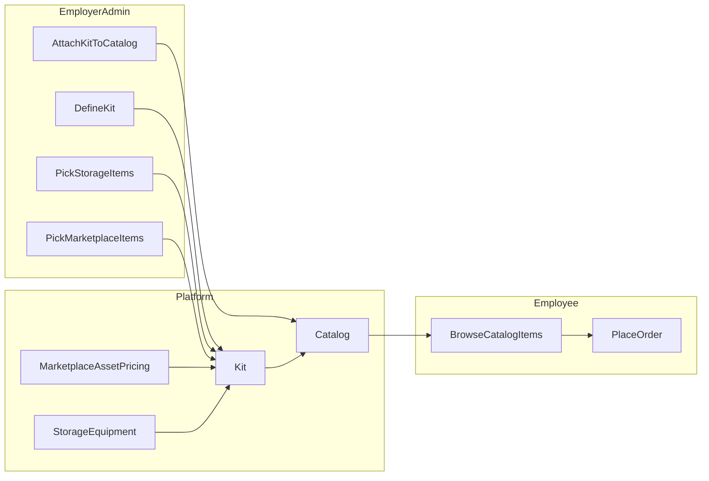

# PRD: Kits, curated budget catalogs, and in-storage assets

**Document status:** Draft  
**Last updated:** 2026-03-31  
**Owners:** Product / Engineering  

---

## 1. Summary

Customers need **multi-country catalog eligibility** (especially with budget-based rules) **without** exposing the full marketplace to every employee. They also want **standard device bundles** (“kits”) and the ability to offer **company-owned equipment already held in Rayda storage** as selectable catalog items alongside marketplace SKUs.

This document describes the **current system behavior**, the **new requirements**, proposed **product scope**, and **open decisions** for engineering and design.

---

## 2. Problem statement

### 2.1 Business problems

1. **Curated choice vs breadth:** Budget catalogs today surface a **wide** set of purchasable items (see §3.2). Employers with defined standards do not want employees browsing an unconstrained catalog.
2. **Multi-country operations:** Companies operating in several countries need catalogs that **trigger and apply** across those countries while still respecting **per-country pricing and availability**.
3. **Reuse of owned inventory:** Companies send devices into **Rayda storage**; they want those assets to be **eligible for reassignment** through the same catalog flows employees already use for marketplace orders.

### 2.2 Outcomes we want

- Employers can define **kits** (named bundles of allowed devices/accessories) and attach them to catalogs—especially **budget** catalogs—so employees only see **approved options**.
- **Multi-country** support remains first-class for catalog targeting (countries, levels, departments) without forcing the “full marketplace” experience.
- **In-storage company equipment** can appear in catalog browsing and order flows where product rules allow, with correct **availability**, **ownership**, and **fulfillment** behavior.

---

## 3. Current state of the system

This section reflects behavior in the **remote-v2-backend** and **remote-v2-frontend** codebase as understood at authoring time.

### 3.1 Catalog types

The system defines catalog types via `CatalogTypeEnum`:

- **`device`:** Curated SKU lists via the `catalog_assets` pivot (employer-selected `asset_pricing` rows).
- **`budget`:** Budget limits and related configuration via `catalog_configs`; used for spend-controlled flows.

**Reference:** [`remote-v2-backend/app/Domains/Enum/Catalog/CatalogTypeEnum.php`](../remote-v2-backend/app/Domains/Enum/Catalog/CatalogTypeEnum.php)

### 3.2 How “catalog assets” resolve today

On the `Catalog` model, the `assets()` relation behaves differently by type:

- **Budget catalog:** Returns a query over **`AssetPricing`** filtered by the **employee’s country** and the **employer’s currency**—i.e. a **broad marketplace-style pool**, not a row-by-row curated list stored on the catalog.
- **Device catalog:** Returns **`catalog_assets`** — explicit allowlisted SKUs.

**Reference:** [`remote-v2-backend/app/Models/Catalog.php`](../remote-v2-backend/app/Models/Catalog.php) (`assets()`).

### 3.3 API constraints

- Adding/removing curated assets is **rejected for budget catalogs** (“Wrong catalog type specified.”).

**Reference:** [`remote-v2-backend/app/Http/Controllers/V2/Backend/CatalogController.php`](../remote-v2-backend/app/Http/Controllers/V2/Backend/CatalogController.php) (`addCatalogAssets`, `removeAssetsFromCatalog`).

### 3.4 Multi-country catalogs

- Catalogs accept **`country_ids`** on create; rows are stored in **`catalog_countries`** (see repository create flow).
- The **admin UI** currently emphasizes **multi-select countries for budget catalogs** and a **single-country** style path for device catalog creation in places—product should align UX with backend capabilities.

**References:**

- [`remote-v2-backend/app/Repositories/CatalogRepository.php`](../remote-v2-backend/app/Repositories/CatalogRepository.php) (`createCatalog` → `catalogCountries`).
- [`remote-v2-frontend/src/container/Dashboard/Catalogs/CreateCatalogs/index.tsx`](../remote-v2-frontend/src/container/Dashboard/Catalogs/CreateCatalogs/index.tsx).

### 3.5 Marketplace asset listing for a catalog

When listing assets with a `catalog_id`, the backend uses `$catalog->assets` (same relation as above), so **budget catalogs inherit the broad `AssetPricing` pool** behavior.

**Reference:** [`remote-v2-backend/app/Http/Controllers/V2/Backend/AssetController.php`](../remote-v2-backend/app/Http/Controllers/V2/Backend/AssetController.php) (`filterAssets`).

### 3.6 Storage inventory (company-owned equipment)

Company equipment is modeled primarily as **`Equipment`** (`equipments` table), associated with a **company**, with status including **`IN_STORAGE`** for items held in storage. There is an **`EquipmentInStorage`** model/table linked to equipment for storage-specific records.

Companies can query **items in storage** at the model layer (e.g. `Company::items_in_storage()`).```

**References:**

- [`remote-v2-backend/app/Models/Equipment.php`](../remote-v2-backend/app/Models/Equipment.php) (`catalog()` relationship exists; `storage_info()`).
- [`remote-v2-backend/app/Models/Company.php`](../remote-v2-backend/app/Models/Company.php) (`items_in_storage`, `storage_locations`).
- [`remote-v2-backend/app/Models/EquipmentInStorage.php`](../remote-v2-backend/app/Models/EquipmentInStorage.php).

**Gap:** There is **no** first-class link today between a **catalog** and **specific storage-held equipment** as orderable catalog line items in the same sense as `catalog_assets` / marketplace `AssetPricing`.

---

## 4. New requirements

### 4.1 Kits (functional)

1. **Definition:** A **Kit** is a company-scoped named bundle (e.g. “Standard Engineer Laptop Kit”) that contains an allowlist of items.
2. **Kit contents:** Each kit item MUST be one of:
   - **Marketplace item:** References an `asset_pricing` row (or equivalent marketplace SKU) appropriate to the employee’s country/currency rules.
   - **In-storage item:** References company inventory in storage (see §4.2), subject to availability rules.
3. **Attachment to catalogs:** Employers MUST be able to attach one or more kits to a catalog (especially **budget** catalogs) so that **employee-facing browsing is constrained** to kit contents (not the full marketplace pool), while preserving budget rules where applicable.
4. **Multi-country:** Kits and/or catalog targeting MUST support employers operating in **multiple countries**, including:
   - eligibility (who receives the catalog),
   - correct **per-country** marketplace items,
   - correct **per-country** storage inventory.

### 4.2 In-storage assets in catalogs (functional)

1. **Selection:** Employers MUST be able to mark or select **storage-held equipment** (or storage inventory groupings) to be included in kits (or directly in catalogs if product chooses that path—see §6).
2. **Availability:** The system MUST reflect **real availability** (e.g. quantity of unassigned units, serial-level uniqueness, location constraints).
3. **Fulfillment:** Ordering an in-storage item MUST trigger the correct **internal fulfillment** workflow (allocation, pick/pack/ship, status transitions), distinct from pure marketplace purchase flows where applicable.
4. **Permissions & audit:** Clear ownership by **company**, immutable audit trail for **assignment** of company-owned assets.

### 4.3 Non-functional requirements

1. **Backward compatibility:** Existing catalogs that rely on current budget behavior MUST continue to work until migrated or explicitly switched to “kit-constrained mode” (see §6.1).
2. **Performance:** Catalog browsing must remain fast with pagination; kit resolution must not N+1 query unbounded marketplace rows.
3. **Security:** Employees must only see inventory and pricing permitted for their **company**, **role**, and **country** context.

---

## 5. User personas & primary journeys

### 5.1 Employer admin

- Creates/edits **kits** (marketplace + in-storage items).
- Attaches kits to **budget** (and optionally **device**) catalogs.
- Confirms multi-country targeting matches company policy.

### 5.2 Employee

- Receives catalog access (existing triggers: level/department/country rules).
- Opens catalog and sees **only** kit-allowed items (plus any explicitly allowed non-kit items if product permits—default should be **kit-only** when kits are attached).
- Completes an order; marketplace vs storage items may differ at checkout/fulfillment.

### 5.3 Operations / Rayda internal (if applicable)

- Fulfills storage-backed selections from the correct **storage location** with correct **serial** assignment.

---

## 6. Proposed solution outline (for engineering discovery)

This is a **product-facing** outline; implementation may differ after technical discovery.

### 6.1 Catalog resolution rules (compatibility)

When a budget catalog has **no kits attached**, behavior remains **as today** (broad `AssetPricing` pool subject to existing filters).

When a budget catalog has **one or more kits attached**, employee catalog browsing resolves to the **union of kit items** (filtered by employee context), instead of the full marketplace pool.

### 6.2 Kit entity

Introduce a `Kit` entity scoped to `company_id`:

- Metadata: name, description, status.
- Optional: countries applicability (either at kit level or inferred from items).

Kit items should support:

- `source = marketplace | storage`
- references to marketplace pricing rows and/or storage inventory identifiers
- optional per-item constraints (max qty, notes, approval flags)

### 6.3 Linking kits to catalogs

Introduce `catalog_kit` (or equivalent) many-to-many between `catalogs` and `kits`.

### 6.4 Storage inventory reference model

Choose one of these approaches (decision required):

1. **Serial-backed:** Kit references eligible `Equipment` rows (or filtered subsets) where `status` supports selection.
2. **Grouped SKU:** Kit references a grouping key (make/model/type) and availability is computed from open storage units.

The existing `Equipment` / `EquipmentInStorage` models are the likely anchor points.

### 6.5 API / UI surfaces (high level)

- Admin: CRUD kits, manage kit items, attach kits to catalogs.
- Employee: catalog item list endpoint returns a **normalized** list of `{ source, display, availability, pricing/budget impact }`.



---

## 7. Open questions (must be resolved in design)

1. **Budget consumption:** Do in-storage company-owned items **consume** catalog budget, **partially consume**, or **zero** budget?
2. **Pricing display:** For storage items, do we show **$0**, **book value**, **replacement value**, or **hidden price**?
3. **Duplicate offers:** If the same device spec exists as marketplace and storage, do we show **both**, **storage first**, or **dedupe**?
4. **Partial kit fulfillment:** If one kit line is unavailable, do we block checkout or allow partial orders?
5. **Device catalog + kits:** Should kits be **budget-only**, or also attachable to **device** catalogs to unify admin workflows?
6. **Migration:** How do we migrate existing budget catalogs to kit-constrained mode without customer disruption?

---

## 8. Success metrics

- Reduction in support tickets about “employees seeing too many devices” for budget catalogs using kits.
- Adoption: % of budget catalogs with at least one kit.
- Order success rate for storage-backed catalog selections (pick/pack/ship completion times, error rate).
- Employer satisfaction (qualitative) on multi-country + standard bundles.

---

## 9. Phasing suggestion

1. **Phase 1 — Kits + marketplace-only kit items** on budget catalogs (curated selection; multi-country filtering).
2. **Phase 2 — In-storage kit items** + fulfillment/assignment workflows + availability.
3. **Phase 3 — Migration tools** + admin analytics + polish.

---

## 10. Out of scope (initial PRD)

- Partner marketplace changes unrelated to catalog resolution.
- New subscription packaging (unless explicitly required).

---

## 11. References (code)

| Area | File |
|------|------|
| Catalog asset resolution | [`remote-v2-backend/app/Models/Catalog.php`](../remote-v2-backend/app/Models/Catalog.php) |
| Catalog type guards | [`remote-v2-backend/app/Http/Controllers/V2/Backend/CatalogController.php`](../remote-v2-backend/app/Http/Controllers/V2/Backend/CatalogController.php) |
| Catalog create (countries) | [`remote-v2-backend/app/Repositories/CatalogRepository.php`](../remote-v2-backend/app/Repositories/CatalogRepository.php) |
| Asset listing w/ catalog | [`remote-v2-backend/app/Http/Controllers/V2/Backend/AssetController.php`](../remote-v2-backend/app/Http/Controllers/V2/Backend/AssetController.php) |
| Equipment / storage | [`remote-v2-backend/app/Models/Equipment.php`](../remote-v2-backend/app/Models/Equipment.php), [`remote-v2-backend/app/Models/EquipmentInStorage.php`](../remote-v2-backend/app/Models/EquipmentInStorage.php) |

---

## 12. Revision history

| Version | Date | Author | Notes |
|---------|------|--------|-------|
| 0.1 | 2026-03-31 | — | Initial draft from codebase review + stakeholder requirements |

